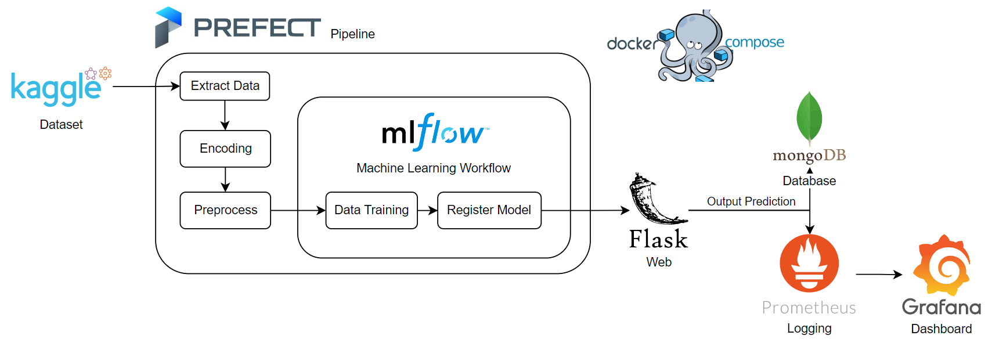
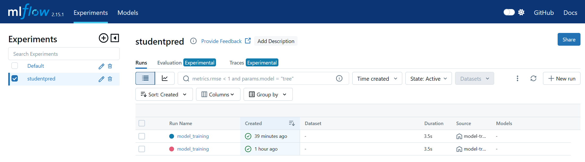
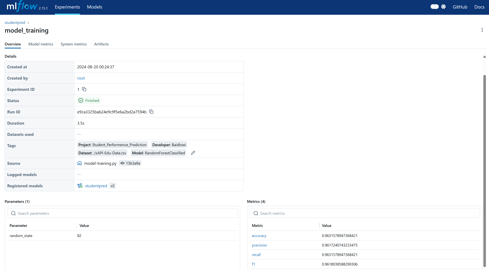
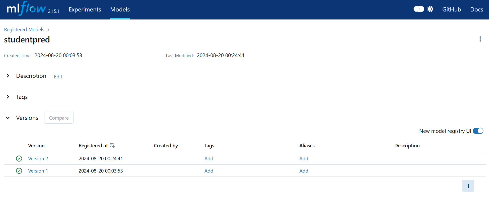
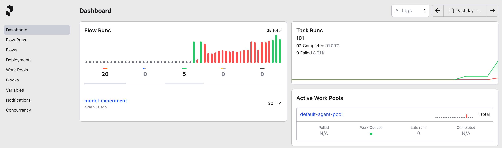
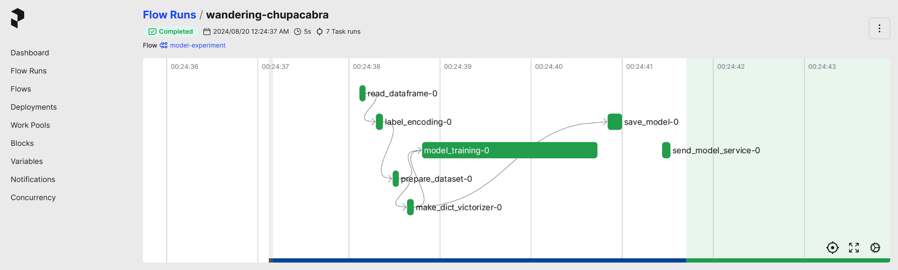
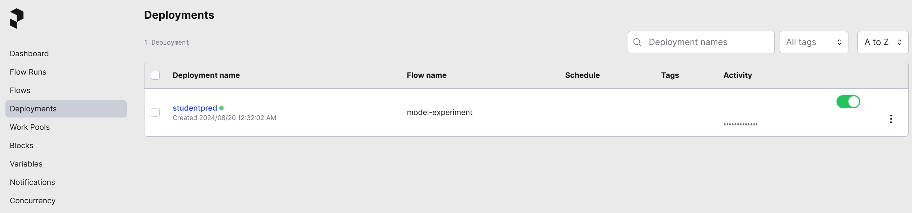
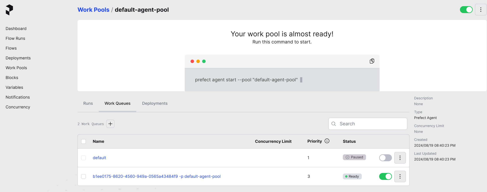

# Student Performance Prediction

## Project Overview



### Tools Stack
- Kaggle : Download dataset
- Prefect : Data pipelines and workflows orchestration
- MLFlow : Machine Learning workflow
- Docker Compose - Containerization services
- Flask : Web UI
- MongoDB : Output database
- Prometheus : Monitoring Logging
- Grafana : Monitoring prediction

## Project evaluation criteria:
https://github.com/DataTalksClub/mlops-zoomcamp/tree/main/07-project

## Project description

This is the final project for the course `mlops-zoomcamp` from [DataTalksClub](https://github.com/DataTalksClub/mlops-zoomcamp).

**Project pain point**:
Higher education has a complex challenge to understand the performance of its students which influences the success of these students. Academic grades, student activity, and background can influence student success. This research uses data from the University of Northampton, United Kingdom which is analyzed using a classification algorithm method to predict student performance as support for improving the quality of higher education for the better. 

The project provides an online service for predicting student who will have the performance of their studies.

The project's focus is to make a Production service with experiment tracking using **MLflow**, pipeline automation using **Prefect** as workflow orchestration, and observability using **Prometheus**, and **Grafana** for monitoring.

## Dataset

The dataset has been taken from [Kaggle](https://www.kaggle.com/datasets/aljarah/xAPI-Edu-Data). 

## Project preparations

This project is implemented on 'codespace' github:

## Project structure

This project repository contains 2 folders and a README.md

1. dataset folder contains train datasets.
2. code folder contains the main source code with configurations file includes.

  - Dockerfile
  - docker-compose.yml
  - MLflow database
  - Prefect database
  - Prediction services
  - Monitoring

## Project overview

The project started by the training the model with `model-training.py` and promote the model to the MLFlow registry with `model-registry.py`. **MLflow** being used for model experiment tracking, model registry, store the model artifacts by saving to the database `studentpred.db`. 

**Prefect** is a powerful tool for orchestrating complex workflows, including machine learning pipelines. It provides a robust framework for defining, scheduling, and monitoring tasks, making it an excellent choice for managing the various components of an ML project.

This project implemented a **Grafana** and **Prometheus**-based observability solution to empower the operations team. Prometheus, a time-series database and monitoring system, collects metrics from various sources. Grafana, an open-source visualization platform, enables the team to analyze this data effectively. This combined solution allows the operations team to swiftly address issues or collaborate with other teams for informed decision-making
  
## Project instruction

### Pre-Installation

```bash
apt update
apt install containerd
apt install docker.io
curl -L https://github.com/docker/compose/releases/download/v2.16.0/docker-compose-$(uname -s)-$(uname -m) -o /usr/local/bin/docker-compose
chmod +x /usr/local/bin/docker-compose

pip install mlflow
pip install -U prefect
```

### 1. Project repository

```bash
git clone https://github.com/baidlowi/prediction-student-performance.git
```

Clone the project to the local server.

### 2. Work directory

```bash
cd ./prediction-student-performance
```

### 3. Build the services up

```bash
docker-compose up -d
```

This command will run the docker-compose to build up the services and dependencies for the services.

### 4. Environment preparation

```bash
pipenv shell
pipenv install
```

This command will install all required dependencies and activtte the environment from this requisition of this project.

### 5. MLflow preparation

```bash
mlflow ui -h 0.0.0.0 -p 5050 --backend-store-uri sqlite:///studentpred.db --default-artifact-root ./mlops
```

This command will build the mlflow service to work in this project e.g. `database` and `MLflow UI`.

**link**: http://localhost:5050/

**MLflow tracking**


**MLflow Everview Model**


**MLflow Versioning Model**



### 6. Prefect preparation

```bash
prefect server start
```

The command above will set the `PREFECT API URL` at localhost with port 4200 and start `prefect orion` 

**link**: http://0.0.0.0:4200/

**NOTE**: for use prefect as remote server need to set with the command:
**Prefect Home**


### 7. MLflow Model training and monitoring

```bash
python model-training.py
```

**Prefect flow**


Run python script `model_training.py` to start training the model. For this project use `RandomForestClassifier` to classification the data between student who will classification **Low**,  **Middle**, or **High** performance.

In order to inspect the training process or details apart from command line. Open the `MLflow UI` or `Prefect UI` instead.

### 8. MLflow Model registry and artifacts

```bash
python model-registry.py
```

Run `model-registry.py` to retrieve the data of the model from the `MLflow database` and compare current model in the production with the new model. If the new model is better then transition this new model to the production and give the archive stage to the production model.

### 9. Prefect deployment

```bash
prefect deployment build model-deployment.py:model_experiment -n studentpred
```

**Prefect deployment**


The command above will create the deployment from `model-deployment.py` and return the **deployment ID** in the terminal.

### 10. Prefect work-queue

```bash
prefect deployment apply model_experiment-deployment.yaml
```
```bash
prefect work-queue create <deployment ID> <work-queue name>
```


### 11. Prefect agent

```bash
prefect agent start <work-queue ID>
```

After created the work-queue. now the `Prefect agent` can work on the deployment to help the pipeline run in the specify time by schedule the deployment

### 12. Test Model prediction

Now the model ready to use after training and deploy to the production and the services should be ready to serve the prediction result of each student who will get **Low**,  **Middle**, or **High** performance.

```bash
python test.py
```
